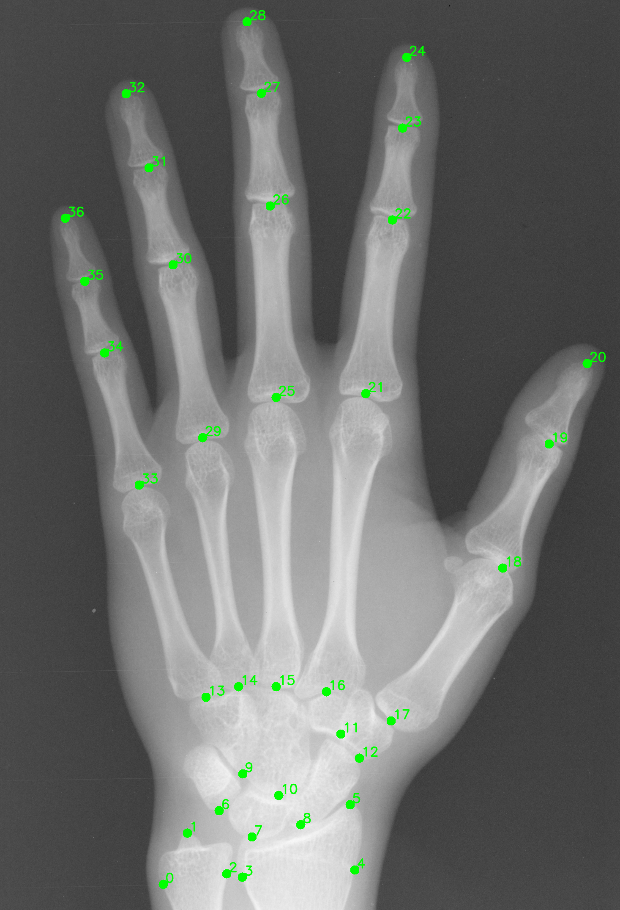

## Introduction
Code for all tests can be found here for the Digital Hand Dataset. **All splits used can be found in hand/.** The full-shot split is the same at that in [Zhu et al., “You only learn once: Universal anatomical landmark detection,"](https://arxiv.org/abs/2103.04657).



## Requirements
- Python 3 
- CUDA and cuDNN 
- Python packages in requirements.txt
- Download [Digital Hand Dataset](https://github.com/razorx89/digital-hand-atlas-downloader)


## Usage
For extracting metadata, use 
```
python get_meta.py
``` 
and point the path to the DHA downloaded folder.

### FM-OSD
1. Run 

   ```
   python data_generate.py
   ```
    with 
    - cfg file found in hand/hand.yaml
    - text files in hand/
    - images and annotations from DHA.


2. In the setup folder, install the custom CUDA code using
   ```
   python setup.py install
   ```


3. Run
   ```
   python script_maker_train.py
   ```
    to train both the global and local branch
    - csv_train is generated by preprocessing step 1.


4. Run
   ```
   python script_maker_test.py
   ```
    with the weights from the global and local branch (--weights_global, --weights_local) to run inference and output DP values.

### UNet
1. For training, run 
   ```
   python train.py
   ```
   with the same arguments as above.


2. For inference, run 
   ```
   python test.py
   ```
   with the same arguments as above and --weight with the saved weight file from training.


### Random Forest
Run 
```
python tree.py
```
with the .csv of outputs from test_dp.py.


## Acknowledgement
Code for both models is adapted from [FM-OSD](https://github.com/JuzhengMiao/FM-OSD) and [UNet](https://github.com/jfm15/ContourHuggingHeatmaps). The authors would like to acknowledge the use of the University of Oxford Advanced Research Computing (ARC) facility in carrying out this work: https://doi.org/10.5281/zenodo.22558.


